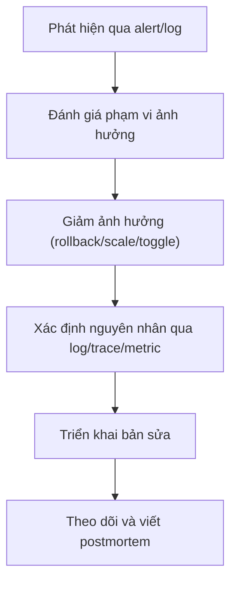

# Roadmap ôn tập Backend (Spring) — 1.5 YOE Backend, 4 YOE Mobile chuyển sang

Xuất phát điểm này khác một dev backend thuần: bạn đã có 4 năm tư duy production — architecture, debugging, release, incident — chỉ cần ánh xạ tư duy đó sang domain backend (DB, concurrency, network server-side, distributed system). Roadmap này **không dạy lại OOP hay Spring cơ bản**, mà tập trung vào chiều sâu kỹ thuật và tư duy hệ thống mà 1.5 năm code feature thường chưa chạm tới.

Mục tiêu sau roadmap:

* Thiết kế và technical-own một service Spring Boot từ đầu đến production.
* Chẩn đoán được memory leak, deadlock, N+1 query, race condition, latency spike.
* Thiết kế API, database schema và transaction boundary đúng, không over/under-engineering.
* Hiểu và vận hành được service trong môi trường có tải thật (concurrency, scaling, failure).
* Review code, thiết kế hệ thống nhỏ-vừa và hỗ trợ on-call/incident.

## Roadmap 12 tuần

Chu trình mỗi tuần:

1. Review kiến thức.
2. Áp dụng vào một service thật (dự án hiện tại hoặc project tự dựng).
3. Xử lý một tình huống sự cố.
4. Viết lại decision/checklist để tái sử dụng.

---

### Tuần 0 — Đánh giá năng lực hiện tại

Audit một service bạn đang maintain hoặc từng làm:

* Kiến trúc và layer boundary (controller/service/repository).
* Database schema và transaction.
* API design và error handling.
* Concurrency và async processing.
* Security (auth, authorization, input validation).
* Caching.
* Testing.
* Build, CI/CD, deployment.
* Logging, monitoring.
* Performance dưới tải.

Tự chấm từng nhóm:

| Mức | Khả năng                                        |
| --- | ----------------------------------------------- |
| 0   | Chưa biết hoặc chưa từng làm                    |
| 1   | Biết khái niệm                                  |
| 2   | Có thể tự triển khai                            |
| 3   | Có thể debug và tối ưu                          |
| 4   | Có thể thiết kế, review và hướng dẫn người khác |

Với 1.5 YOE backend, mục tiêu thực tế: phần lớn chủ đề đạt mức 2–3; riêng API design, database và debugging nên hướng tới mức 3 sau roadmap. Mức 4 (system design, distributed system) là mục tiêu dài hạn hơn 12 tuần.

---

### Tuần 1 — JVM và Spring internals

Review:

* JVM memory model: heap, stack, metaspace.
* Garbage collector cơ bản (G1) và khi nào GC gây latency spike.
* Classloading, và tại sao Spring Boot fat-jar chạy được.
* IoC container: BeanFactory, ApplicationContext.
* Bean lifecycle: instantiation → dependency injection → post-processor → destroy.
* Bean scope: singleton, prototype, request, session.
* `@Autowired` vs constructor injection — vì sao constructor injection là best practice.
* Proxy-based AOP: vì sao `@Transactional` hay `@Async` không hoạt động khi gọi method nội bộ (self-invocation).
* Auto-configuration: cách Spring Boot quyết định bean nào được tạo.

Thực hành:

* Viết một custom `BeanPostProcessor` hoặc `@Conditional` đơn giản.
* Tái hiện lỗi self-invocation với `@Transactional` và sửa nó.
* Đo heap usage của một service bằng JVM flags/DevTools tương đương (`jcmd`, `jstat`).

Sự cố mô phỏng:

> Một method gọi `this.saveAndNotify()` bên trong cùng class, `@Transactional` không rollback khi có exception. Xác định nguyên nhân do proxy AOP và đề xuất cách tổ chức lại code.

---

### Tuần 2 — Concurrency và async processing

Review:

* Thread pool: `Executor`, `ThreadPoolTaskExecutor`, cấu hình core/max/queue size.
* Race condition, deadlock, livelock.
* `synchronized`, `Lock`, `ReentrantLock`, `volatile`, `AtomicInteger`.
* `CompletableFuture` và xử lý bất đồng bộ.
* `@Async` trong Spring — pitfall thường gặp.
* Connection pool (HikariCP): sizing, leak detection.
* Thread-per-request vs reactive (Servlet stack vs WebFlux) — khi nào cần cái nào.

Thực hành:

* Tái hiện race condition khi hai request cùng cập nhật một dòng dữ liệu, sau đó fix bằng lock/optimistic locking.
* Cấu hình và benchmark thread pool cho một endpoint gọi API bên ngoài.
* Tìm connection pool leak (không đóng connection/transaction) trong code cũ.

Sự cố mô phỏng:

> Dưới tải cao, service bắt đầu trả timeout hàng loạt dù CPU không cao. Xác định do connection pool exhaustion hay thread pool queue đầy, và phân biệt hai nguyên nhân này.

---

### Tuần 3 — Database, transaction và query performance

Review:

* Transaction isolation level: Read Committed, Repeatable Read, Serializable.
* Transaction propagation: `REQUIRED`, `REQUIRES_NEW`, `NESTED`.
* Optimistic locking (`@Version`) vs pessimistic locking (`SELECT FOR UPDATE`).
* N+1 query problem và cách phát hiện (Hibernate/JPA).
* Fetch type: `LAZY` vs `EAGER`, và `LazyInitializationException`.
* Index: khi nào cần, composite index, covering index.
* Query execution plan (`EXPLAIN`).
* Connection pool tuning.
* Migration tool: Flyway/Liquibase.

Thực hành:

* Tìm và sửa một N+1 query bằng `JOIN FETCH` hoặc `@EntityGraph`.
* Viết một migration có rollback plan.
* Phân tích execution plan của một query chậm và thêm index phù hợp.
* Tái hiện deadlock giữa hai transaction cập nhật chéo hai bảng.

Sự cố mô phỏng:

> Một API list dữ liệu chạy nhanh với 100 bản ghi nhưng chậm hẳn với 10.000 bản ghi. Xác định N+1 hay thiếu index, và đo trước/sau khi fix.

---

### Tuần 4 — API design và error handling

Review:

* REST design: resource naming, versioning, pagination, filtering.
* HTTP status code dùng đúng ngữ cảnh (400 vs 422, 409, 429).
* Idempotency cho POST/PUT (đặc biệt endpoint thanh toán, tạo đơn hàng).
* `@ControllerAdvice`/`@ExceptionHandler` — error response chuẩn hóa.
* Validation: Bean Validation (`@Valid`, custom validator).
* DTO vs Entity — vì sao không expose Entity trực tiếp.
* API contract: OpenAPI/Swagger.
* Backward compatibility khi thay đổi API.

Thực hành:

* Thiết kế lại một API đang trả Entity trực tiếp thành DTO có validation đầy đủ.
* Xây dựng global exception handler trả error format nhất quán.
* Thiết kế idempotency key cho một endpoint tạo đơn hàng.
* Viết OpenAPI spec cho một module.

Sự cố mô phỏng:

> Client bấm nút submit hai lần do mạng chậm, hệ thống tạo hai đơn hàng trùng. Thiết kế cơ chế idempotency để ngăn việc này mà không chặn nhầm các request hợp lệ.

---

### Tuần 5 — Caching và performance

Review:

* Cache layer: local (Caffeine) vs distributed (Redis).
* Cache-aside, write-through, write-behind.
* Cache invalidation — "there are only two hard things in CS".
* TTL, stale data risk.
* `@Cacheable`, `@CacheEvict` trong Spring.
* Read replica cho query nặng.
* Batch processing thay vì loop từng bản ghi.
* Profiling: xác định bottleneck là CPU, I/O hay network.
* Load testing cơ bản (JMeter/k6/Gatling).

Thực hành:

* Thêm cache cho một endpoint đọc nhiều, hiếm khi đổi.
* Thiết kế cache invalidation khi dữ liệu gốc thay đổi (event-based hoặc TTL).
* Load test một API, đo p50/p95/p99 latency trước và sau tối ưu.
* Chuyển một vòng lặp gọi DB N lần thành một batch query.

Không chấp nhận kết luận "cảm giác nhanh hơn". Phải có số đo (latency, throughput) trước và sau.

Sự cố mô phỏng:

> Sau khi bật cache, một số user thấy dữ liệu cũ dù đã cập nhật. Xác định lỗi cache invalidation và sửa mà không tắt hẳn cache.

---

### Tuần 6 — Security

Review:

* Authentication: session-based vs JWT — trade-off.
* Authorization: role-based (RBAC) vs permission-based.
* Spring Security filter chain, cách request đi qua.
* Password hashing (BCrypt), salt.
* CSRF, CORS — khi nào cần, khi nào không (API thuần vs có cookie).
* SQL injection — vì sao dùng JPA/prepared statement không tự động miễn nhiễm hoàn toàn.
* Input validation và output encoding (XSS khi trả HTML).
* Secret management (không hardcode credential, dùng vault/env).
* Rate limiting chống brute-force/abuse.

Thực hành:

* Viết một custom `Filter`/`SecurityFilterChain` xử lý JWT.
* Thiết kế refresh token flow, xử lý khi nhiều request cùng refresh (liên hệ trực tiếp kinh nghiệm mobile của bạn — vấn đề y hệt phía client).
* Rà soát một API tìm lỗ hổng injection hoặc thiếu authorization check (IDOR — user A sửa được data user B qua đổi ID trên URL).
* Thêm rate limiting cho endpoint login.

Sự cố mô phỏng:

> Một endpoint `/orders/{id}` không kiểm tra order có thuộc về user gọi request hay không — user A đổi ID trên URL để xem đơn của user B. Đây là lỗi IDOR (Insecure Direct Object Reference) kinh điển; hãy tìm và fix authorization check.

---

### Tuần 7 — Messaging và event-driven

Review:

* Message queue (Kafka/RabbitMQ) — khi nào cần thay vì gọi trực tiếp.
* At-least-once vs at-most-once vs exactly-once delivery.
* Idempotent consumer — xử lý message bị gửi lại.
* Dead-letter queue.
* Outbox pattern — đảm bảo consistency giữa DB write và event publish.
* Event ordering và partition (Kafka).
* Synchronous vs asynchronous communication giữa service.
* Retry với backoff cho consumer lỗi tạm thời.

Thực hành:

* Viết một producer/consumer đơn giản, đảm bảo consumer idempotent.
* Thiết kế outbox pattern cho một thao tác "lưu đơn hàng + gửi event".
* Cấu hình dead-letter queue và alert khi message vào DLQ.

Sự cố mô phỏng:

> Consumer xử lý message hai lần do broker gửi lại (network retry), khiến số dư ví bị trừ hai lần. Thiết kế lại consumer để idempotent.

---

### Tuần 8 — Microservice và distributed system cơ bản

Review:

* Monolith vs microservice — chi phí thật của việc tách service.
* Service-to-service communication: REST, gRPC, message queue.
* Circuit breaker, retry, timeout (Resilience4j).
* Distributed transaction: 2PC vs Saga pattern.
* Service discovery, API Gateway (khái niệm, không cần tự vận hành hết).
* CAP theorem ở mức áp dụng thực tế, không học thuộc lòng.
* Distributed tracing — vì sao cần khi debug qua nhiều service.

Thực hành:

* Thêm circuit breaker cho một call tới service phụ thuộc hay lỗi.
* Thiết kế Saga đơn giản cho luồng "đặt hàng → trừ kho → thanh toán" khi một bước có thể fail.
* Vẽ sequence diagram cho một luồng gọi qua 3 service.

Sự cố mô phỏng:

> Service thanh toán bị chậm 5 giây, khiến toàn bộ service đặt hàng bị nghẽn theo (cascading failure). Thiết kế timeout + circuit breaker để cô lập sự cố.

---

### Tuần 9 — Testing và code quality

Review:

* Unit test (JUnit 5, Mockito).
* Integration test (`@SpringBootTest`, Testcontainers cho DB thật).
* Test pyramid áp dụng cho backend.
* Contract test giữa service (Pact hoặc tương đương).
* Test transaction rollback, test concurrency (nếu cần).
* Static analysis, lint, code review checklist.
* Test data builder/fixture thay vì hardcode.

Thực hành:

* Viết integration test dùng Testcontainers cho một repository có query phức tạp.
* Test một luồng có transaction rollback khi có lỗi giữa chừng.
* Thiết lập quality gate (coverage tối thiểu cho logic quan trọng, không chạy theo % tổng thể) trong CI.

Ưu tiên test (giống tư duy mobile của bạn, áp dụng lại):

1. Logic gây tổn thất tiền hoặc dữ liệu.
2. Authentication và authorization.
3. Migration.
4. Luồng chính tạo giá trị (checkout, payment...).
5. Chi tiết trình bày/response phụ.

---

### Tuần 10 — Build, CI/CD và deployment

Review:

* Containerization: Dockerfile cho Spring Boot, multi-stage build.
* Environment/profile management (`application-{profile}.yml`).
* Secret management trong CI/CD.
* CI pipeline: build → test → static analysis → image → deploy.
* Blue-green deployment, canary release.
* Health check, readiness/liveness probe (nếu dùng Kubernetes).
* Rolling update và zero-downtime deployment.
* Rollback strategy.
* Feature flag/toggle cho backend.

Thực hành:

* Viết Dockerfile multi-stage tối ưu kích thước image.
* Thiết lập CI pipeline đầy đủ các bước.
* Thiết kế health check endpoint đúng chuẩn (phân biệt liveness và readiness).
* Thiết kế rollback plan khi deploy version mới bị lỗi.

Sự cố mô phỏng:

> Version mới deploy xong, một số pod bắt đầu bị kill liên tục do liveness probe fail dù service vẫn xử lý request bình thường. Xác định nguyên nhân cấu hình probe sai và sửa.

---

### Tuần 11 — Observability và incident handling

Review:

* Structured logging, correlation ID xuyên qua các service.
* Metrics: latency, throughput, error rate (RED method) hoặc USE method cho resource.
* Distributed tracing (OpenTelemetry, Zipkin/Jaeger).
* Alert threshold — tránh alert fatigue.
* SLI/SLO/SLA — phân biệt và áp dụng thực tế.
* Log level dùng đúng ngữ cảnh (không log INFO tràn lan).
* Incident severity và escalation.
* Root cause analysis và postmortem không đổ lỗi cá nhân.

Quy trình xử lý sự cố:

Thực hành:

* Thêm correlation ID cho một request đi qua 2–3 service.
* Viết dashboard tối thiểu: latency p95, error rate, throughput cho một service.
* Mô phỏng incident và viết postmortem gồm: tác động, timeline, nguyên nhân gốc, cách khắc phục, biện pháp phòng ngừa.

---

### Tuần 12 — System design và technical ownership

Review:

* Chuyển yêu cầu business thành technical design document.
* Ước lượng capacity: QPS, dung lượng dữ liệu, băng thông.
* Trade-off: consistency vs availability, latency vs throughput.
* Build-vs-buy cho một thành phần hạ tầng.
* ADR (Architecture Decision Record).
* Technical debt — khi nào chấp nhận, khi nào phải trả.
* Code review và mentoring cho dev junior hơn.
* Ước lượng và chia task trong sprint.

Thực hành capstone — Chọn một hệ thống production như order/checkout, ví điện tử, chat, hoặc booking, thiết kế đầy đủ:

1. Requirement và acceptance criteria.
2. API contract.
3. Database schema, index, transaction boundary.
4. Concurrency handling (nơi nào cần lock, idempotency).
5. Caching strategy.
6. Security (auth, authorization, rate limit).
7. Communication pattern (sync/async, event nếu có).
8. Failure handling: retry, circuit breaker, fallback.
9. Test plan.
10. Deployment và rollback plan.
11. Monitoring và alert plan.
12. Capacity estimate và scaling plan.

---

## Bộ bài toán thực tế nên luyện

Sau roadmap, bạn nên xử lý được các bài toán:

* API chậm hẳn khi dữ liệu tăng lên (N+1, thiếu index).
* Hai request đồng thời gây lost update hoặc double-write.
* Refresh token bị gọi đồng thời từ nhiều thread/instance.
* Connection pool cạn kiệt dưới tải cao.
* Consumer xử lý message trùng lặp.
* Cascading failure khi một service phụ thuộc chậm.
* Cache trả dữ liệu cũ sau khi update.
* Deadlock giữa hai transaction.
* Migration lỗi với dữ liệu cũ tồn tại từ lâu.
* IDOR — user truy cập được dữ liệu không thuộc về mình.
* Deploy version mới làm tăng error rate hoặc restart loop.
* Hai team cùng sửa chung một service gây conflict schema/API.
* Một service chạy ổn nhưng không đạt SLA khi traffic tăng đột biến.

## Tiêu chí hoàn thành roadmap

Bạn đạt mức backend vững (~2.5–3 YOE thực chất) khi có thể:

* Giải thích quyết định kỹ thuật bằng trade-off (consistency/availability, latency/throughput), không chỉ bằng thói quen.
* Đọc execution plan và profile trước khi tối ưu.
* Thiết kế transaction, concurrency và idempotency ngay từ đầu, không vá sau.
* Debug xuyên suốt từ API → service → DB → message queue → service khác.
* Chủ động thiết kế monitoring, alert và rollback cho service mình phụ trách.
* Review được API/schema design và nhận diện rủi ro trước khi merge.
* Dẫn dắt một feature từ requirement đến sau khi lên production và theo dõi kết quả.
* Viết ADR và checklist để chuẩn hóa quy trình làm việc.

## Lợi thế bạn đã có từ 4 năm mobile — đừng bỏ phí

* **Tư duy debugging hệ thống** (crash, leak, jank) ánh xạ gần như 1-1 sang deadlock, memory leak, latency spike ở backend — bạn chỉ cần đổi công cụ (DevTools → APM/profiler JVM), không cần học lại cách tư duy.
* **Kinh nghiệm networking phía client** (refresh token race, retry, idempotency, offline sync) chính là các bài toán bạn sẽ thiết kế ở phía server — bạn đã hiểu vấn đề từ góc nhìn hậu quả, giờ học cách phòng từ gốc.
* **Kỷ luật release/rollback/monitoring** từ mobile áp dụng thẳng sang CI/CD và observability backend, phần này nhiều dev backend 1.5 YOE còn yếu — đây có thể là điểm bạn vượt trội hơn bạn nghĩ.

Nên dành khoảng 6–8 giờ/tuần: hai buổi review/thực hành, một buổi incident/capstone. Mỗi tuần tạo ra một bằng chứng cụ thể (PR, benchmark, test suite, ADR, postmortem) — lưu tập trung vào một repo cá nhân để dùng làm minh chứng khi đánh giá năng lực.
