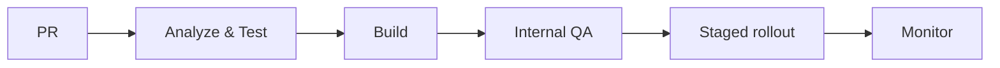

Đúng, 6 điểm phản biện này đều cần thiết. Roadmap nên được mở rộng thành **12 tuần + Tuần 0 đánh giá đầu vào**, hướng đến năng lực Senior Flutter/Technical Owner và khả năng phụ trách 2–3 dự án song song.

## 1. Cách học trong từng tuần

Mỗi tuần dành 6–8 giờ:

| Buổi     | Thời lượng | Nội dung                                            |
| -------- | ---------: | --------------------------------------------------- |
| Buổi 1   |  1.5–2 giờ | Review kiến thức, đọc code và xác định vấn đề       |
| Buổi 2   |    2–3 giờ | Implement/refactor trên project thật                |
| Buổi 3   |      2 giờ | Incident drill, debugging, performance hoặc testing |
| Tổng kết |    30 phút | Ghi ADR, checklist, benchmark hoặc postmortem       |

Mỗi tuần phải có ít nhất một bằng chứng:

- Pull request hoặc source code.
- Test suite.
- Benchmark trước/sau.
- Architecture Decision Record.
- Checklist.
- Incident report hoặc postmortem.
- Technical proposal.

---

# 2. Roadmap chi tiết

## Tuần 0 — Baseline audit

### Mục tiêu

Xác định chính xác năng lực hiện tại, tránh học dàn trải.

### Audit một project Flutter đã làm

1. Dart và Flutter internals.
2. Architecture.
3. State management.
4. Networking.
5. Local database và offline.
6. Performance.
7. Native integration.
8. Security.
9. Testing.
10. CI/CD và release.
11. Observability.
12. Accessibility và localization.
13. Technical ownership.
14. Quản lý đa dự án.
15. Giao tiếp với stakeholder.

### Thang điểm

| Điểm | Năng lực                                                              |
| ---: | --------------------------------------------------------------------- |
|    0 | Chưa biết hoặc chưa từng làm                                          |
|    1 | Biết khái niệm nhưng cần hướng dẫn                                    |
|    2 | Có thể tự triển khai trường hợp thông thường                          |
|    3 | Có thể debug, tối ưu và xử lý production                              |
|    4 | Có thể thiết kế, review, giải thích trade-off và hướng dẫn người khác |

Không tự chấm chỉ bằng cảm giác. Mỗi điểm từ 3 trở lên cần có bằng chứng như code, incident từng xử lý, benchmark hoặc tài liệu thiết kế.

### Deliverable

- Bảng baseline score.
- Danh sách 5 khoảng trống lớn nhất.
- Một project được chọn làm project thực hành chính.
- Một backlog học tập được ưu tiên theo rủi ro production.

---

## Tuần 1 — Dart, concurrency và Flutter internals

### Review

- Event loop và microtask queue.
- Future, Stream, async/await.
- Cancellation và timeout.
- Isolate, `compute` và message passing.
- Immutable object, equality, generics.
- Widget, Element và RenderObject.
- Build, layout, paint, compositing.
- Widget lifecycle.
- Key và element identity.
- Scheduler và frame lifecycle.

### Thực hành

- Dự đoán thứ tự chạy của event và microtask.
- Parse JSON lớn trên UI isolate, đo thời gian rồi chuyển sang isolate.
- Tạo demo cho thấy sự khác nhau giữa rebuild, relayout và repaint.
- Tìm nguyên nhân một widget rebuild không cần thiết.
- So sánh ValueKey, ObjectKey và GlobalKey trong danh sách động.

### Incident drill

> Một màn hình nhận JSON lớn và bị đứng 2–3 giây. Sau tối ưu, app hết đứng nhưng dữ liệu đôi lúc hiển thị kết quả cũ vì request trước hoàn thành sau request mới.

Cần giải quyết cả:

- CPU-bound work.
- Request cancellation hoặc response versioning.
- Race condition.
- Trạng thái loading/error.

### Deliverable

- Benchmark trước/sau.
- Một tài liệu giải thích Flutter rendering pipeline.
- Checklist debug rebuild/layout/paint.

---

## Tuần 2 — Architecture và state management

### Review

- Feature-first và layer-first.
- Presentation, application/domain và data.
- Dependency inversion.
- Repository và use case.
- Domain model, DTO và UI model.
- State cục bộ, feature state và global state.
- Bloc/Cubit, Riverpod hoặc giải pháp project đang sử dụng.
- Dependency injection.
- Module boundary.
- Circular dependency.
- Khi nào không nên dùng Clean Architecture đầy đủ.

### Thực hành

Refactor một feature có:

- Pagination.
- Pull-to-refresh.
- Filter.
- Cached data.
- Partial error.
- Retry.
- Empty state.
- Refresh ngầm.

Thiết kế state phải trả lời được:

- Có cho phép giữ dữ liệu cũ khi refresh lỗi không?
- Loading lần đầu và refreshing khác nhau thế nào?
- State nào phải tồn tại sau khi màn hình bị dispose?
- Business rule nằm ở đâu?
- Có thể thay API bằng fake repository để test không?

### Incident drill

> Hai màn hình cùng sửa một global state làm dữ liệu của nhau bị reset. Fix nhanh bằng cách thêm điều kiện khiến state ngày càng khó kiểm soát.

### Deliverable

- Sơ đồ dependency.
- PR refactor một feature.
- Một ADR giải thích lựa chọn state management và architecture.

---

## Tuần 3 — Networking và reliable data flow

### Review

- HTTP lifecycle.
- Timeout theo connection/read/write.
- Request cancellation.
- Typed error.
- Retry và exponential backoff.
- Idempotency.
- Authentication và refresh token.
- Pagination.
- Upload/download.
- Cache policy.
- Stale-while-revalidate.
- API backward compatibility.
- Mapping DTO → domain → UI.

### Thực hành

Xây dựng networking layer hỗ trợ:

- Một refresh-token request duy nhất tại một thời điểm.
- Queue các request đang chờ token.
- Không retry lỗi business hoặc validation.
- Hủy request khi không còn cần thiết.
- Correlation/request ID.
- Redact token và dữ liệu nhạy cảm khỏi log.
- Parse lỗi API không làm crash ứng dụng.

### Incident drill

> Nhiều API cùng trả `401`, tạo ra nhiều refresh request. Một request refresh thành công nhưng request khác thất bại và đăng xuất người dùng.

### Deliverable

- Refresh-token coordinator.
- Error taxonomy.
- Test cho retry, timeout, refresh token và out-of-order response.

---

## Tuần 4 — Local database, offline và security foundation

### Data và offline

Review:

- Shared preferences, secure storage và database.
- Transaction.
- Index và query plan cơ bản.
- Schema versioning.
- Migration tuần tự.
- Offline queue.
- Optimistic update.
- Sync state.
- Conflict resolution.
- Cache invalidation.

Thực hành:

- Migration từ version 1 → 2 → 3 → 4.
- Test nâng cấp trực tiếp từ từng version cũ.
- Offline queue có retry và idempotency key.
- Khôi phục khi app bị kill giữa quá trình đồng bộ.

### Security foundation

Review:

- Không nhúng API secret có giá trị vào mobile app.
- Secure storage cho access/refresh token.
- Không lưu token bằng preferences thông thường.
- Xóa hoặc redact PII/token khỏi log.
- Mã hóa dữ liệu nhạy cảm khi cần.
- Session expiration và logout.
- Screenshot protection cho màn hình nhạy cảm khi business yêu cầu.
- Clipboard và deep-link security.
- Dependency security.
- Dùng OWASP MASVS/MSTG làm checklist review.

### Incident drill

> User nâng cấp từ version rất cũ bị crash vì thiếu migration trung gian; log production đồng thời chứa access token.

### Deliverable

- Migration test matrix.
- Data classification: public/internal/sensitive.
- Mobile security checklist cho project.

---

## Tuần 5 — Performance, accessibility và localization

### Performance

Review:

- Frame budget.
- UI thread và raster thread.
- Build/layout/paint cost.
- List virtualization.
- Image resize/decode/cache.
- Shader và animation.
- Startup time.
- Memory allocation.
- Memory leak từ listener, timer, controller và subscription.
- Flutter DevTools.

Thực hành:

- Đo cold start và warm start.
- Profile một màn hình scroll dài.
- Tối ưu ảnh theo kích thước hiển thị.
- Tìm object bị giữ lại sau khi đóng màn hình.
- So sánh frame timing trước và sau refactor.

### Accessibility

Kiểm tra:

- Semantics label.
- TalkBack/VoiceOver.
- Text scale lớn.
- Contrast.
- Tap target.
- Focus order.
- Keyboard navigation nếu hỗ trợ tablet/web.
- Reduced motion.
- Không truyền tải thông tin chỉ bằng màu sắc.

### Localization

Kiểm tra:

- ARB/localization resources.
- Plural và gender nếu có.
- Ngày, giờ, số và tiền tệ.
- Chuỗi dài gây overflow.
- RTL.
- Nội dung trả về từ backend.
- Không ghép câu bằng nhiều chuỗi dịch rời rạc.

### Incident drill

> App chạy tốt bằng tiếng Việt nhưng giao diện vỡ khi chuyển sang tiếng Đức và text scale 200%.

### Deliverable

- Performance report trước/sau.
- Accessibility checklist.
- Screenshot/test cho ít nhất hai locale và text scale lớn.

---

## Tuần 6 — Buffer và mid-roadmap audit

Tuần này không thêm chủ đề mới.

### Công việc

- Hoàn thiện bài tập còn thiếu.
- Review lại các PR của tuần 1–5.
- Chọn một chủ đề yếu để đào sâu.
- Chạy lại benchmark performance.
- Kiểm tra test migration và networking.
- Đánh giá lại các mục đã học.

### Mid-audit

Với mỗi chủ đề, xác định:

- Đã hiểu nhưng chưa áp dụng.
- Đã áp dụng nhưng chưa test.
- Đã test nhưng chưa trải qua tình huống production.
- Có thể giải thích và review cho người khác.

Nếu bị chậm kế hoạch, ưu tiên theo thứ tự:

1. Networking và authentication.
2. Migration và dữ liệu.
3. Performance.
4. Architecture.
5. Accessibility/localization.

### Deliverable

- Báo cáo tiến độ.
- Backlog được điều chỉnh.
- Không để bài tập quan trọng tồn đọng sang quá hai tuần.

---

## Tuần 7 — Native integration và mobile security nâng cao

### Native integration

Review:

- Android Activity/lifecycle.
- Intent, service và broadcast receiver.
- Runtime permission.
- Gradle, flavor và signing.
- R8/ProGuard.
- iOS lifecycle.
- Entitlement, permission và provisioning.
- Background mode.
- Platform Channel/Pigeon.
- Deep link và universal/app link.
- Push notification.
- App bị kill và state restoration.

### Security nâng cao

Review:

- TLS và network security configuration.
- Certificate pinning và operational trade-off.
- Pin rotation và cơ chế dự phòng.
- Root/jailbreak detection: giới hạn và false positive.
- Code obfuscation.
- Flutter `--obfuscate` và quản lý debug symbols.
- Android R8/ProGuard.
- iOS symbol stripping và release configuration.
- Deep-link validation.
- WebView security.
- Biometric authentication.
- Replay attack và idempotency.

Lưu ý: obfuscation và root detection chỉ làm tăng chi phí tấn công, không biến client thành môi trường đáng tin cậy. Business rule và secret quan trọng vẫn phải được bảo vệ ở backend.

### Incident drill

> Certificate được rotate trên server làm toàn bộ phiên bản app cũ sử dụng pinning không thể kết nối.

Yêu cầu đưa ra phương án:

- Backup pin.
- Pin-expiration strategy.
- Feature flag/kill switch nếu kiến trúc cho phép.
- Monitoring trước và sau certificate rotation.

### Deliverable

- Native integration demo.
- Threat model cho một feature nhạy cảm.
- Security review report.

---

## Tuần 8 — Testing và quality engineering

### Review

- Unit test.
- Widget test.
- Integration test.
- Golden test.
- Fake, mock và stub.
- Contract test.
- Migration test.
- Test pyramid.
- Flaky test.
- Static analysis.
- Code coverage theo rủi ro thay vì chạy theo tỷ lệ tuyệt đối.

### Test priority

1. Thanh toán, tiền và dữ liệu không thể phục hồi.
2. Authentication và authorization.
3. Database migration.
4. Offline synchronization.
5. Luồng chính tạo giá trị.
6. UI phụ.

### Thực hành

- Test refresh-token race condition.
- Test migration từ tất cả version đang còn user.
- Widget test cho loading/error/retry/empty.
- Integration test cho luồng chính.
- Fake clock cho timeout/session expiry.
- Failure injection: mạng chậm, API lỗi, database đầy.

### Incident drill

> Test pass trên local nhưng thường xuyên fail trên CI do animation, timing và request bất đồng bộ.

### Deliverable

- Test strategy.
- Quality gate cho CI.
- Danh sách flaky test và nguyên nhân.

---

## Tuần 9 — CI/CD, release và dependency management

### Review

- Dev/staging/production flavors.
- Secret injection.
- Signing.
- Version/build number.
- Automated build.
- Store submission.
- Staged rollout.
- Feature flag.
- Remote config.
- Kill switch.
- Rollback.
- Dependency upgrade.
- Crash symbol và source map management.

### Thực hành

Thiết kế pipeline:

Xây dựng release gate:

- Test pass.
- Migration được kiểm tra.
- Crash symbols được upload.
- Security checklist hoàn thành.
- Accessibility smoke test.
- Analytics event được xác nhận.
- Có owner theo dõi sau release.
- Có rollback/mitigation plan.

### Incident drill

> Version mới tăng crash rate nhưng không thể rollback ngay trên store.

### Deliverable

- CI/CD pipeline hoặc bản thiết kế tương đương.
- Release checklist.
- Staged rollout và rollback playbook.

---

## Tuần 10 — Observability và incident management

### Review

- Structured logging.
- Crash và non-fatal error.
- Crash-free users/sessions.
- ANR.
- Startup time.
- Frame performance.
- Network failure rate.
- Correlation ID.
- Analytics event.
- Alert threshold.
- Incident severity.
- Root cause analysis.
- Blameless postmortem.

### Quy trình incident

1. Xác nhận sự cố.
2. Đánh giá phạm vi ảnh hưởng.
3. Phân loại severity.
4. Giảm ảnh hưởng trước.
5. Thu thập evidence.
6. Xác định nguyên nhân gốc.
7. Deploy fix hoặc mitigation.
8. Theo dõi sau fix.
9. Viết postmortem.
10. Tạo action phòng ngừa.

### Incident drill

> Crash chỉ xảy ra trên một số thiết bị Android, sau khi app chạy nền nhiều giờ và được mở lại từ notification.

### Deliverable

- Dashboard mobile health.
- Incident runbook.
- Một postmortem hoàn chỉnh.
- Danh sách alert tránh cả thiếu cảnh báo lẫn alert fatigue.

---

## Tuần 11 — Technical ownership và giao tiếp stakeholder

### Phân tích yêu cầu

Từ một yêu cầu business, cần làm rõ:

- Vấn đề của người dùng là gì?
- Metric nào cần thay đổi?
- Scope MVP là gì?
- Dependency với backend, QA, design và release.
- Edge case.
- Risk.
- Assumption chưa được xác nhận.
- Điều kiện nghiệm thu.

### Ước lượng

Không chỉ đưa ra một con số. Estimate nên gồm:

- Phạm vi đã tính.
- Phần chưa rõ.
- Dependency.
- Best/likely/worst case.
- Testing và release effort.
- Technical risk.
- Buffer phù hợp.
- Điều kiện làm thay đổi estimate.

Ví dụ cách trao đổi:

> Phương án A mất khoảng 5–7 ngày, ít rủi ro nhưng chưa hỗ trợ offline. Phương án B mất 9–12 ngày, hỗ trợ offline nhưng cần thay đổi API và migration database. Với mục tiêu release trong sprint này, đề xuất A và lên kế hoạch B ở phase tiếp theo.

### Giao tiếp với PM/business

Dùng cấu trúc:

1. Impact.
2. Evidence.
3. Options.
4. Trade-off.
5. Recommendation.
6. Decision needed.

Tránh giải thích thuần kỹ thuật như “phải refactor Bloc”. Hãy chuyển sang ngôn ngữ tác động:

> Nếu tiếp tục sửa trực tiếp vào state hiện tại, thời gian phát triển ngắn hơn khoảng hai ngày nhưng rủi ro regression ở checkout cao hơn và khó mở rộng promotion trong sprint sau.

### Thực hành

- Viết technical proposal cho một feature.
- Trình bày proposal dưới hai dạng:
  - Bản kỹ thuật cho dev.
  - Bản một trang cho PM/business.

- Mô phỏng scope change giữa sprint.
- Đàm phán cắt scope mà vẫn giữ giá trị chính.
- Viết weekly status không quá một trang.

### Deliverable

- Technical design.
- Stakeholder one-pager.
- Estimate breakdown.
- ADR.
- Risk register.

---

## Tuần 12 — Quản lý 2–3 dự án, capstone và re-audit

## A. Quản lý nhiều dự án song song

### Portfolio board

Mỗi project cần hiển thị:

| Project | Mục tiêu | Trạng thái | Risk lớn nhất | Blocker | Next milestone | Owner |
| ------- | -------- | ---------- | ------------- | ------- | -------------- | ----- |

### Context-switching

Áp dụng nguyên tắc:

- Gom công việc tương tự vào cùng khoảng thời gian.
- Hạn chế đổi project liên tục trong ngày.
- Trước khi dừng project, ghi:
  - đang làm gì;
  - đã xác nhận điều gì;
  - bước tiếp theo;
  - blocker;
  - file/PR liên quan.

- Dành khung giờ cố định để review PR và xử lý support.
- Phân biệt việc khẩn cấp với việc quan trọng.

### Chuẩn hóa giữa các project

Tạo bộ template chung:

- Project README.
- Architecture overview.
- ADR.
- Pull request template.
- Coding convention.
- Release checklist.
- Incident template.
- Security checklist.
- Definition of Done.
- Environment/flavor convention.
- Observability convention.

Không ép mọi project dùng cùng architecture nếu domain và quy mô khác nhau. Chuẩn hóa quy trình, quality gate và cách ra quyết định trước; chuẩn hóa code sau khi đã có nhu cầu thật.

### Shared package và monorepo

Chỉ tách shared package khi:

- Có ít nhất hai consumer thực sự.
- API của package tương đối ổn định.
- Có owner.
- Có test và versioning.
- Lợi ích lớn hơn coupling tạo ra.

Có thể chia sẻ:

- Design system.
- Networking foundation.
- Logging/analytics abstraction.
- Lint rules.
- Authentication primitives.
- Common CI scripts.

Không nên chia sẻ quá sớm:

- Business model khác domain.
- Feature thay đổi thường xuyên.
- Repository/use case chỉ giống nhau bề ngoài.

Dùng monorepo/Melos khi:

- Các package có vòng đời liên quan.
- Team cần thay đổi đồng thời nhiều package.
- CI có thể kiểm tra affected packages.
- Quy trình release/versioning được thống nhất.

Nếu các project độc lập về team và release, private package registry hoặc repository riêng có thể dễ quản lý hơn.

### Review PR nhiều codebase

Khi review:

1. Xác nhận mục tiêu PR.
2. Kiểm tra correctness và data loss trước.
3. Kiểm tra security và concurrency.
4. Kiểm tra architecture.
5. Kiểm tra test.
6. Sau cùng mới đến style.
7. Phân biệt rõ:
   - blocking issue;
   - suggestion;
   - question;
   - optional improvement.

### Multi-project incident drill

Giả lập cùng lúc:

- Project A có crash production.
- Project B đang chờ review để release.
- Project C bị thay đổi scope.

Yêu cầu:

- Phân loại severity.
- Xác định việc nào phải xử lý ngay.
- Delegate hoặc trì hoãn có chủ đích.
- Giao tiếp rõ ETA và ảnh hưởng với stakeholder.
- Không để cả ba project cùng rơi vào trạng thái “đang làm”.

---

## B. Capstone Technical Owner

Chọn một feature đủ phức tạp, ví dụ checkout, chat, video, bản đồ hoặc offline form.

Tạo trọn bộ:

1. Business objective.
2. Acceptance criteria.
3. User flow.
4. Architecture.
5. State model.
6. API contract.
7. Database và migration.
8. Offline/retry strategy.
9. Threat model.
10. Accessibility/localization plan.
11. Test strategy.
12. Monitoring.
13. Release/rollback.
14. Estimate.
15. Risk register.
16. Stakeholder proposal.

---

## C. Re-audit cuối roadmap

Lặp lại đúng bảng đánh giá của Tuần 0, không thay đổi tiêu chí để tránh tự nâng điểm.

### So sánh

| Năng lực                  | Điểm đầu | Điểm cuối | Bằng chứng | Gap còn lại |
| ------------------------- | -------: | --------: | ---------- | ----------- |
| Flutter internals         |          |           |            |             |
| Architecture              |          |           |            |             |
| Networking                |          |           |            |             |
| Database/offline          |          |           |            |             |
| Performance               |          |           |            |             |
| Security                  |          |           |            |             |
| Accessibility/i18n        |          |           |            |             |
| Testing                   |          |           |            |             |
| Release                   |          |           |            |             |
| Incident handling         |          |           |            |             |
| Stakeholder communication |          |           |            |             |
| Multi-project ownership   |          |           |            |             |

### Quy tắc chấm lại

Chỉ đạt mức 3 khi:

- Đã tự implement.
- Có test hoặc measurement.
- Có thể debug khi xảy ra lỗi.
- Có thể giải thích trade-off.

Chỉ đạt mức 4 khi:

- Có thể thiết kế từ đầu.
- Review được giải pháp của người khác.
- Đưa ra tiêu chuẩn dùng chung.
- Có thể hướng dẫn team.
- Chịu trách nhiệm được khi lên production.

### Kết quả cuối cùng

Sau re-audit, tạo kế hoạch 90 ngày tiếp theo:

- Ba năng lực cần nâng cấp.
- Một năng lực cần đào sâu đến mức chuyên gia.
- Một quy trình cần chuẩn hóa cho team.
- Một vấn đề production cần đo bằng metric.
- Một phần công việc có thể delegate.

## 3. Tiêu chí hoàn thành toàn roadmap

Roadmap được xem là hoàn thành khi bạn có thể:

- Technical-own một feature từ requirement đến production.
- Debug xuyên qua Flutter, native, network và backend.
- Đưa ra quyết định dựa trên evidence và trade-off.
- Quản lý migration, offline, authentication và release risk.
- Đo performance thay vì tối ưu theo cảm giác.
- Đưa security, accessibility và localization vào Definition of Done.
- Giao tiếp estimate/risk bằng ngôn ngữ business.
- Review PR trên nhiều codebase.
- Chuẩn hóa quy trình cho 2–3 dự án.
- Re-audit cho thấy tiến bộ bằng artifact và metric, không chỉ bằng số giờ đã học.
